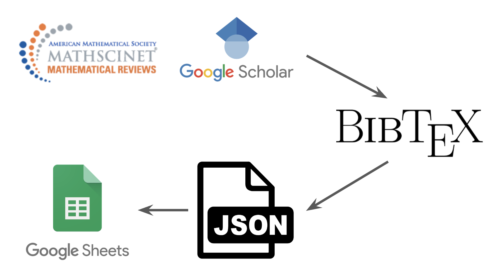
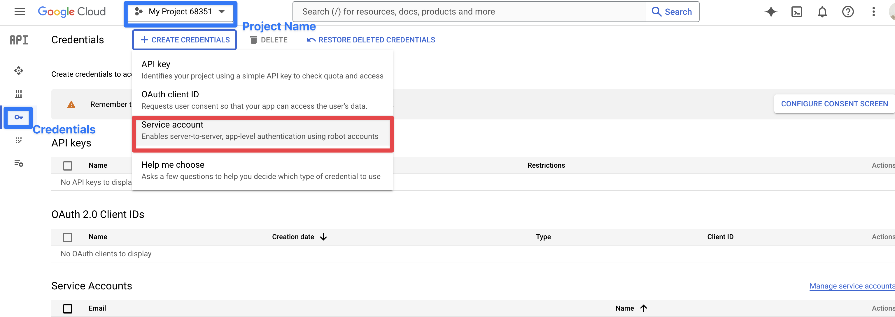

Acknowledgments: I am grateful to a software developer [brianrabern](https://github.com/brianrabern) for his useful Python script. 
Without [his works](https://github.com/brianrabern/bib2json), 
I could not create this tool.

[Template Spreadsheet](https://docs.google.com/spreadsheets/d/1Coq_slHXkb9yP-MEgbqTQQhk9lI_1VgGgByMT8dbzZo/edit?gid=0#gid=0)

# Bib2spsh 

Bib2SPSH (BibTex To SpreadSheet) is a command tool for writing mathematical article information to spreadsheet. It allows you to share articles you looked with colleagues and your professor.



## Features

- Convert BibTeX files to JSON. ([bib2json](https://github.com/brianrabern/bib2json))
- Scanning a BibTex file, write article data to spreadsheet.
- Help researchers, students, and project managers to share reference data with others.

## Usage

1. **Clone the Repository**

```
git clone https://github.com/Ryotaewamoto/bib2spsh.git
```

2. **Set up Spreadsheet and Google API Key**

From [Google Cloud Console](https://console.cloud.google.com/cloud-resource-manager), if you need, create a new project and 
activate **Google Sheets API** and **Google Drive API**.
After that, select APIs and services --> Credentials in your side bar. 




Completing the process, you copy the email address of service account.
Opening the spreadsheet, you provide the above service account the authority of access.

In Credentials page, click the email and select KEYS in the above rows. Adding a new key, you move the json file to service_account.json in this directory. 

#### **`service_account.json`**
```json
{
    "type": "service_account",
    "project_id": "...",
    "private_key_id": "...",
    "private_key": "...",
    "client_email": "...",
    "client_id": "...",
    "auth_uri": "...",
    "token_uri": "...",
    "auth_provider_x509_cert_url": "...",
    "client_x509_cert_url": "...",
    "universe_domain": "..."
  }
```

3. **Install Python Libraries**

```
pip install argparse, gspread, bibtexparser, json, os
```

4. **Put Your Spreadsheet Key and Sheet Name**

Like this, create a new file and write the key and sheet name.

#### **`sp_key.py`**
```python
SP_SHEET_KEY = "YOUR_OWN_SPREADSHEET_KEY"
SHEET_NAME = "Sheet1"
```

5. **Run the System**

You can run the script from the command line. Use the following command:

```bash
python bib2json.py input.bib output.json
```

- `input.bib` should be replaced with the name of your input BibTeX file.
- `output.json` should be replaced with the desired name for your output JSON file.

# Bib2spsh (和訳)

Bib2SPSH (BibTex To SpreadSheet) は数学の論文情報を（JSON に変換し、）スプレッドシートに書き出すツールです。
これを使用することで、あなたが閲覧した論文を記録し、それらを研究室の仲間や教授に共有することができます。

## 特徴

- BibTex ファイルを JSON に変換することができます。
- BibTex ファイルの中身を参照し、スプレッドシートに論文の情報を書き込みます。
- これは、研究者や学生、プロジェクトのリーダーが参考文献を
他の人に共有する際に役立ちます。
